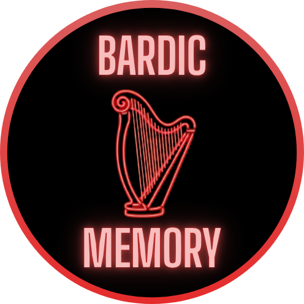
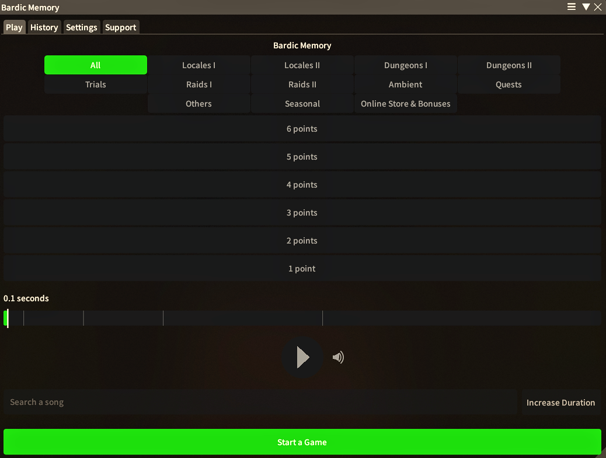
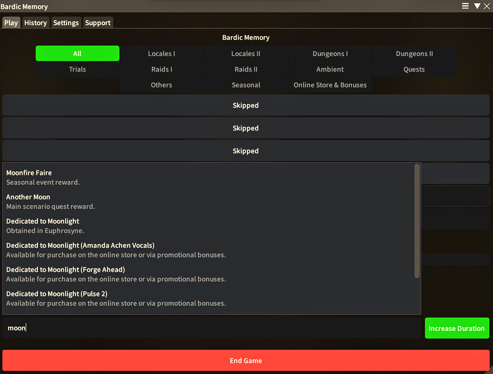
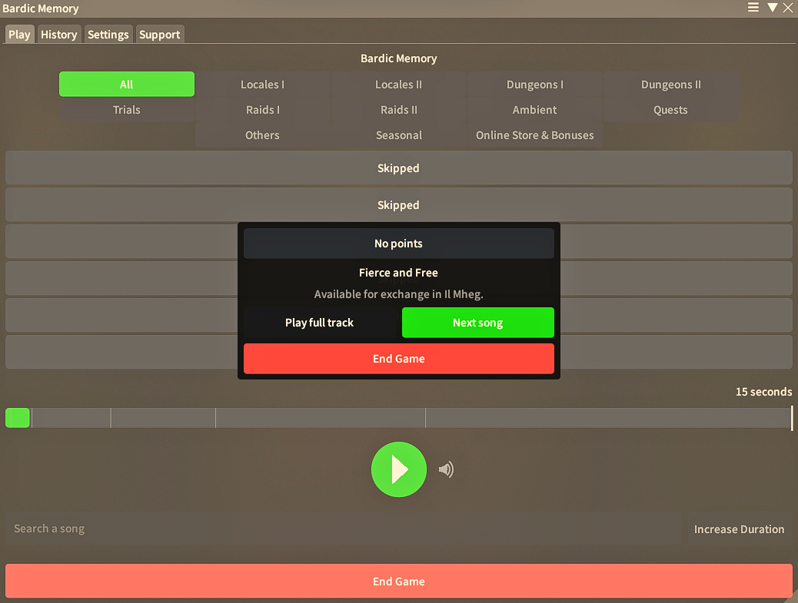
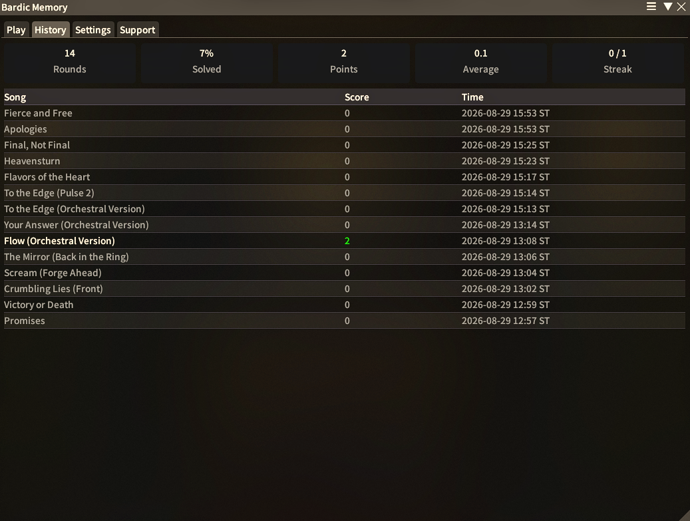
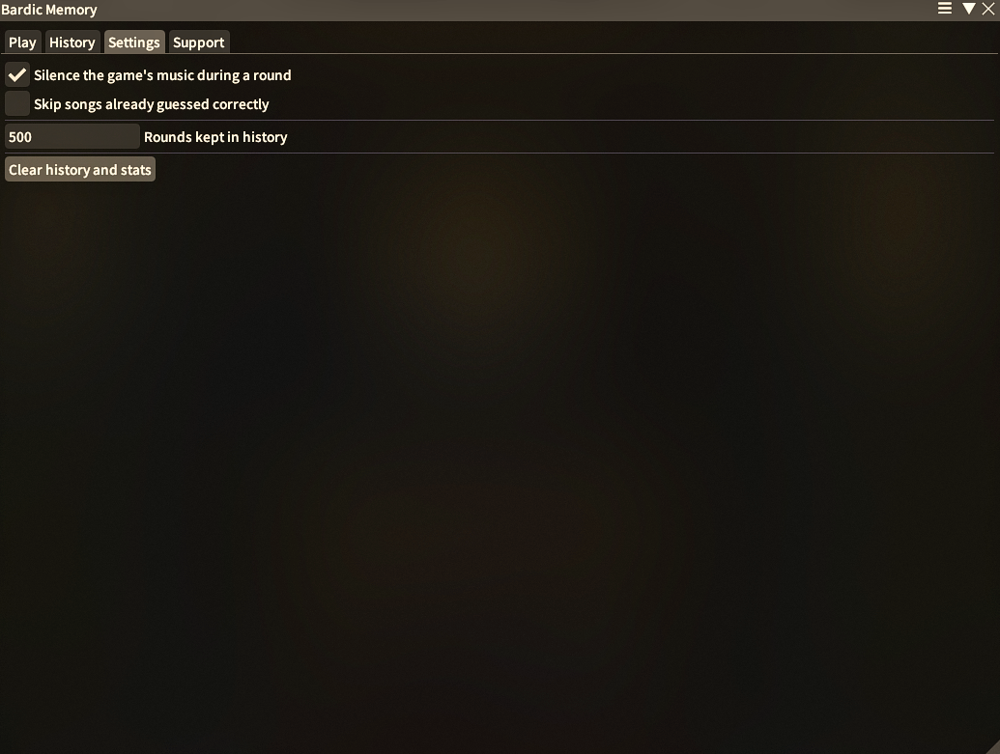

# Bardic Memory

Guess the tune from a sliver of FFXIV's orchestrion library.

`Bardic Memory` is a Dalamud plugin that picks a random orchestrion track, plays you the opening of
it and asks you to name it. The shortest clip is worth six points. Stretch it if you need longer,
and the points come down.

## What It Does

- **Plays the real opening of a track**, starting at a half of a second for six points.
- **Lets you stretch the clip** through 1, 2, 4, 8 and 15 seconds, dropping a point each time you do.
- **Costs you nothing for a wrong guess**, so you can keep naming songs at the length you are on.
- **Filters the pool by orchestrion category**, from locales and dungeons through to raids, trials and seasonal music.
- **Searches every named roll as you type**, ranking titles first, then descriptions, then the places and duties the track plays in.
- **Shows a hint under every search row**, using the description when you matched the title and the locations when you matched where it plays.
- **Gives you a volume slider** beside the play button, from 0 to 100 per cent, so the clip sits at the level you want.
- **Names the track when the round ends**, with the roll's own description and the zones and duties it plays in, then lets you hear the full piece, go on to the next song, or end the game.
- **Logs every finished round** on the history tab, with running totals for rounds, solves, points, average score and streak. Times are shown as **ST**, which is server time.
- **Can skip songs you have already solved**, keeping them out of the pool until every song in the category has been named.

## In Action

Start a game, hear the opening, search for the title and stretch the clip if you need more of it.
When the round ends, a reveal names the track. History keeps the scores and settings sits one tab
along.

## Commands

- `/bardicmemory` - Open the window. Play, History, Settings and Support are all tabs of it.

## How to Install Bardic Memory
Type `/xlplugins`, search for "Bardic Memory" and click **Install**.

## Credits

Bardic Memory plays its clips through the game's background music scene list and the
groundwork for doing that was laid by the [Orchestrion Plugin](https://github.com/perchbirdd/OrchestrionPlugin)
by Meli. Several parts of the playback code are derived from it and the roll to track map
was generated by matching against its song list. It is MIT licensed and
[THIRD-PARTY-NOTICES.md](THIRD-PARTY-NOTICES.md) records what came from where.

## Need help?

Join the [OOF Games Discord](https://discord.gg/vM6ff4h5Ym) and we'll get you sorted!
